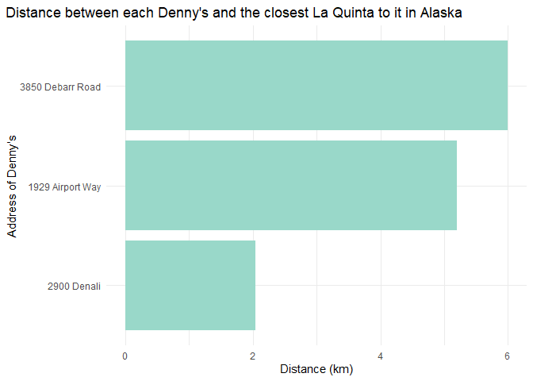

Lab 05 - La Quinta is Spanish for next to Denny’s, Pt. 2
================
Yiwei Tang
2/10/2026

### Load packages and data

``` r
library(tidyverse) 
library(dsbox) 
```

``` r
states <- read_csv("data/states.csv")
```

### Exercise 1

There are three Denny’s locations in Alaska.

``` r
dn_ak <- dennys %>%
  filter(state == "AK")
nrow(dn_ak)
```

    ## [1] 3

There are two La Quinta locations in Alaska.

``` r
lq_ak <- laquinta %>%
  filter(state == "AK")
nrow(lq_ak)
```

    ## [1] 2

### Exercise 2

We need to calculate six locations between the two La Quintas and the
three Denny’s.

``` r
pair <- nrow(lq_ak) * nrow(dn_ak)
```

### Exercise 3

``` r
dn_lq_ak <- full_join(dn_ak, lq_ak,
  by = "state"
)
```

    ## Warning in full_join(dn_ak, lq_ak, by = "state"): Detected an unexpected many-to-many relationship between `x` and `y`.
    ## ℹ Row 1 of `x` matches multiple rows in `y`.
    ## ℹ Row 1 of `y` matches multiple rows in `x`.
    ## ℹ If a many-to-many relationship is expected, set `relationship =
    ##   "many-to-many"` to silence this warning.

``` r
dn_lq_ak
```

    ## # A tibble: 6 × 11
    ##   address.x     city.x state zip.x longitude.x latitude.x address.y city.y zip.y
    ##   <chr>         <chr>  <chr> <chr>       <dbl>      <dbl> <chr>     <chr>  <chr>
    ## 1 2900 Denali   Ancho… AK    99503       -150.       61.2 3501 Min… "\nAn… 99503
    ## 2 2900 Denali   Ancho… AK    99503       -150.       61.2 4920 Dal… "\nFa… 99709
    ## 3 3850 Debarr … Ancho… AK    99508       -150.       61.2 3501 Min… "\nAn… 99503
    ## 4 3850 Debarr … Ancho… AK    99508       -150.       61.2 4920 Dal… "\nFa… 99709
    ## 5 1929 Airport… Fairb… AK    99701       -148.       64.8 3501 Min… "\nAn… 99503
    ## 6 1929 Airport… Fairb… AK    99701       -148.       64.8 4920 Dal… "\nFa… 99709
    ## # ℹ 2 more variables: longitude.y <dbl>, latitude.y <dbl>

### Exercise 4

There are six observations in the joined dn_lq_ak data frame. The
variables are the address, city, zip, longitude, and latitude of both
Denny’s and La Quinta and the state, which is Alaska.

``` r
dim(dn_lq_ak)
```

    ## [1]  6 11

``` r
colnames(dn_lq_ak)
```

    ##  [1] "address.x"   "city.x"      "state"       "zip.x"       "longitude.x"
    ##  [6] "latitude.x"  "address.y"   "city.y"      "zip.y"       "longitude.y"
    ## [11] "latitude.y"

### Exercise 5

To add a new variable to a data frame while keeping the existing
variables, I will use the mutate() function from the tidyverse.

### Exercise 6

``` r
haversine <- function(long1, lat1, long2, lat2, round = 3) {
  # convert to radians
  long1 <- long1 * pi / 180
  lat1 <- lat1 * pi / 180
  long2 <- long2 * pi / 180
  lat2 <- lat2 * pi / 180

  R <- 6371 # Earth mean radius in km

  a <- sin((lat2 - lat1) / 2)^2 + cos(lat1) * cos(lat2) * sin((long2 - long1) / 2)^2
  d <- R * 2 * asin(sqrt(a))

  return(round(d, round)) # distance in km
}

dn_lq_ak <- dn_lq_ak %>% 
  mutate(
    distance = haversine(
      longitude.x,
      latitude.x,
      longitude.y,
      latitude.y
    )
  )
```

### Exercise 7

``` r
dn_lq_ak_min_dist <- dn_lq_ak %>% 
  group_by(address.x) %>% 
  summarise(min_dist = min(distance))
```

### Exercise 8

The distances between Denny’s and the nearest La Quinta locations in
Alaska range from 2.035 to 5.998 kilometers. The mean of the distance is
4.41 km, and the median is 5.197 km.

``` r
max(dn_lq_ak_min_dist$min_dist)
```

    ## [1] 5.998

``` r
min(dn_lq_ak_min_dist$min_dist)
```

    ## [1] 2.035

``` r
mean(dn_lq_ak_min_dist$min_dist)
```

    ## [1] 4.41

``` r
median(dn_lq_ak_min_dist$min_dist)
```

    ## [1] 5.197

``` r
dn_lq_ak_min_dist %>% 
  ggplot(
    aes(
      x = min_dist,
      y = reorder(address.x, min_dist)
    )
  ) +
  geom_bar(fill = "#99d8c9", stat = "identity") +
  labs(
    title = "Distance between each Denny's and the closest La Quinta to it in Alaska",
    x = "Distance (km)",
    y = "Address of Denny's"
  ) +
  theme_minimal() +
  theme(plot.title.position = "plot")
```

<!-- -->
