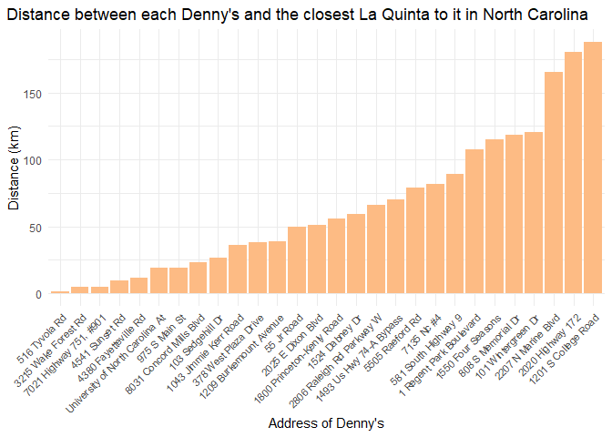
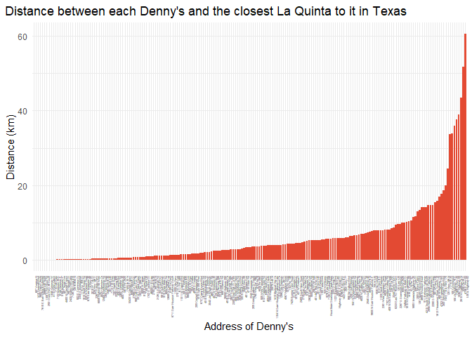
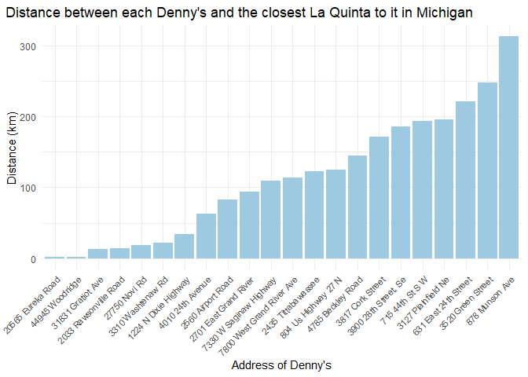

Lab 05 - La Quinta is Spanish for next to Denny’s, Pt. 2
================
Yiwei Tang
2/10/2026

### Load packages and data

``` r
library(tidyverse) 
library(dsbox) 
```

``` r
states <- read_csv("data/states.csv")
```

### Exercise 1

There are three Denny’s locations in Alaska.

``` r
dn_ak <- dennys %>%
  filter(state == "AK")
nrow(dn_ak)
```

    ## [1] 3

There are two La Quinta locations in Alaska.

``` r
lq_ak <- laquinta %>%
  filter(state == "AK")
nrow(lq_ak)
```

    ## [1] 2

### Exercise 2

We need to calculate six locations between the two La Quintas and the
three Denny’s.

``` r
pair <- nrow(lq_ak) * nrow(dn_ak)
```

### Exercise 3

``` r
dn_lq_ak <- full_join(dn_ak, lq_ak,
  by = "state"
)
```

    ## Warning in full_join(dn_ak, lq_ak, by = "state"): Detected an unexpected many-to-many relationship between `x` and `y`.
    ## ℹ Row 1 of `x` matches multiple rows in `y`.
    ## ℹ Row 1 of `y` matches multiple rows in `x`.
    ## ℹ If a many-to-many relationship is expected, set `relationship =
    ##   "many-to-many"` to silence this warning.

### Exercise 4

There are six observations in the joined dn_lq_ak data frame. The
variables are the address, city, zip, longitude, and latitude of both
Denny’s and La Quinta and the state, which is Alaska.

``` r
dim(dn_lq_ak)
```

    ## [1]  6 11

``` r
colnames(dn_lq_ak)
```

    ##  [1] "address.x"   "city.x"      "state"       "zip.x"       "longitude.x"
    ##  [6] "latitude.x"  "address.y"   "city.y"      "zip.y"       "longitude.y"
    ## [11] "latitude.y"

### Exercise 5

To add a new variable to a data frame while keeping the existing
variables, I will use the mutate() function from the tidyverse.

### Exercise 6

``` r
haversine <- function(long1, lat1, long2, lat2, round = 3) {
  # convert to radians
  long1 <- long1 * pi / 180
  lat1 <- lat1 * pi / 180
  long2 <- long2 * pi / 180
  lat2 <- lat2 * pi / 180

  R <- 6371 # Earth mean radius in km

  a <- sin((lat2 - lat1) / 2)^2 + cos(lat1) * cos(lat2) * sin((long2 - long1) / 2)^2
  d <- R * 2 * asin(sqrt(a))

  return(round(d, round)) # distance in km
}

dn_lq_ak <- dn_lq_ak %>% 
  mutate(
    distance = haversine(
      longitude.x,
      latitude.x,
      longitude.y,
      latitude.y
    )
  )
```

### Exercise 7

``` r
dn_lq_ak_min_dist <- dn_lq_ak %>%
  group_by(address.x) %>% 
  summarise(min_dist = min(distance))
```

### Exercise 8

The distances between Denny’s and the nearest La Quinta locations in
Alaska range from 2.035 to 5.998 kilometers. The mean of the distance is
4.41 km, and the median is 5.197 km.

``` r
max(dn_lq_ak_min_dist$min_dist)
```

    ## [1] 5.998

``` r
min(dn_lq_ak_min_dist$min_dist)
```

    ## [1] 2.035

``` r
mean(dn_lq_ak_min_dist$min_dist)
```

    ## [1] 4.41

``` r
median(dn_lq_ak_min_dist$min_dist)
```

    ## [1] 5.197

``` r
dn_lq_ak_min_dist %>% 
  ggplot(
    aes(
      x = min_dist,
      y = reorder(address.x, min_dist)
    )
  ) +
  geom_bar(fill = "#99d8c9", stat = "identity") +
  labs(
    title = "Distance between each Denny's and the closest La Quinta to it in Alaska",
    x = "Distance (km)",
    y = "Address of Denny's"
  ) +
  theme_minimal() +
  theme(plot.title.position = "plot")
```

<!-- -->

### Exercise 9

The distance between the Denny’s in North Carolina and the closest La
Quinta locations range from 1.779 km to 187.935 km. The average distance
is 65.44 km, and the median is 53.46 km.

``` r
dn_nc <- dennys %>%
  filter(state == "NC")
lq_nc <- laquinta %>%
  filter(state == "NC")

dn_lq_nc <- full_join(dn_nc, lq_nc,
  by = "state"
)
```

    ## Warning in full_join(dn_nc, lq_nc, by = "state"): Detected an unexpected many-to-many relationship between `x` and `y`.
    ## ℹ Row 1 of `x` matches multiple rows in `y`.
    ## ℹ Row 1 of `y` matches multiple rows in `x`.
    ## ℹ If a many-to-many relationship is expected, set `relationship =
    ##   "many-to-many"` to silence this warning.

``` r
dn_lq_nc <- dn_lq_nc %>% 
  mutate(
    distance = haversine(
      longitude.x,
      latitude.x,
      longitude.y,
      latitude.y
    )
  )

dn_lq_nc_min_dist <- dn_lq_nc %>%
  group_by(address.x) %>% 
  summarise(min_dist = min(distance))

dn_lq_nc_min_dist %>% 
  ggplot(
    aes(
      y = min_dist,
      x = reorder(address.x, min_dist)
    )
  ) +
  geom_bar(fill = "#fdbb84", stat = "identity") +
  labs(
    title = "Distance between each Denny's and the closest La Quinta to it in North Carolina",
    y = "Distance (km)",
    x = "Address of Denny's"
  ) +
  theme_minimal() +
  theme(plot.title.position = "plot",
        axis.text.x = element_text(
          angle = 45,
          hjust = 1,
          size = 8
        ))
```

<!-- -->

``` r
max(dn_lq_nc_min_dist$min_dist)
```

    ## [1] 187.935

``` r
min(dn_lq_nc_min_dist$min_dist)
```

    ## [1] 1.779

``` r
mean(dn_lq_nc_min_dist$min_dist)
```

    ## [1] 65.44432

``` r
median(dn_lq_nc_min_dist$min_dist)
```

    ## [1] 53.4565

### Exercise 9

The distance between Denny’s in Texas and their closest La Quinta
locations range from 0.016 km to 60.582 km. The average distance is 5.79
km, and the median is 3.37 km. Since there’s too many Denny’s locations
in Texas, it is very hard to show the address of all the individual
locations.

``` r
dn_tx <- dennys %>%
  filter(state == "TX")
lq_tx <- laquinta %>%
  filter(state == "TX")

dn_lq_tx <- full_join(dn_tx, lq_tx,
  by = "state"
)
```

    ## Warning in full_join(dn_tx, lq_tx, by = "state"): Detected an unexpected many-to-many relationship between `x` and `y`.
    ## ℹ Row 1 of `x` matches multiple rows in `y`.
    ## ℹ Row 1 of `y` matches multiple rows in `x`.
    ## ℹ If a many-to-many relationship is expected, set `relationship =
    ##   "many-to-many"` to silence this warning.

``` r
dn_lq_tx <- dn_lq_tx %>% 
  mutate(
    distance = haversine(
      longitude.x,
      latitude.x,
      longitude.y,
      latitude.y
    )
  )

dn_lq_tx_min_dist <- dn_lq_tx %>%
  group_by(address.x) %>% 
  summarise(min_dist = min(distance))

dn_lq_tx_min_dist %>% 
  ggplot(
    aes(
      y = min_dist,
      x = reorder(address.x, min_dist)
    )
  ) +
  geom_bar(fill = "#e34a33", stat = "identity") +
  labs(
    title = "Distance between each Denny's and the closest La Quinta to it in Texas",
    y = "Distance (km)",
    x = "Address of Denny's"
  ) +
  theme_minimal() +
  theme(plot.title.position = "plot",
        axis.text.x = element_text(
          angle = 90,
          hjust = 1,
          size = 3
        ))
```

<!-- -->

``` r
max(dn_lq_tx_min_dist$min_dist)
```

    ## [1] 60.582

``` r
min(dn_lq_tx_min_dist$min_dist)
```

    ## [1] 0.016

``` r
mean(dn_lq_tx_min_dist$min_dist)
```

    ## [1] 5.7918

``` r
median(dn_lq_tx_min_dist$min_dist)
```

    ## [1] 3.3715

### Exercise 10

``` r
dn_mi <- dennys %>%
  filter(state == "MI")
lq_mi <- laquinta %>%
  filter(state == "MI")

dn_lq_mi <- full_join(dn_mi, lq_mi,
  by = "state"
)
```

    ## Warning in full_join(dn_mi, lq_mi, by = "state"): Detected an unexpected many-to-many relationship between `x` and `y`.
    ## ℹ Row 1 of `x` matches multiple rows in `y`.
    ## ℹ Row 1 of `y` matches multiple rows in `x`.
    ## ℹ If a many-to-many relationship is expected, set `relationship =
    ##   "many-to-many"` to silence this warning.

``` r
dn_lq_mi <- dn_lq_mi %>% 
  mutate(
    distance = haversine(
      longitude.x,
      latitude.x,
      longitude.y,
      latitude.y
    )
  )

dn_lq_mi_min_dist <- dn_lq_mi %>%
  group_by(address.x) %>% 
  summarise(min_dist = min(distance))

dn_lq_mi_min_dist %>% 
  ggplot(
    aes(
      y = min_dist,
      x = reorder(address.x, min_dist)
    )
  ) +
  geom_bar(fill = "#9ecae1", stat = "identity") +
  labs(
    title = "Distance between each Denny's and the closest La Quinta to it in Michigan",
    y = "Distance (km)",
    x = "Address of Denny's"
  ) +
  theme_minimal() +
  theme(plot.title.position = "plot",
        axis.text.x = element_text(
          angle = 45,
          hjust = 1,
          size = 8
        ))
```

<!-- -->

### Exercise 12

Among the states I examined, Mitch Hedberg’s joke is most likely to hold
true in Texas. The vast majority of the Denny’s have its closest La
Quinta locations within 10 km, while the other states have a greater
average minimun distance when comparing with Taxes.
